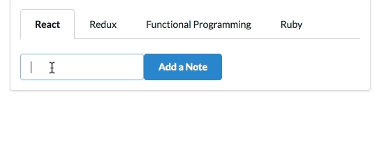

# Redux Challenge


## First Task

Your first task is to implement a note taking app using Redux. You should be able to add notes and delete notes by clicking on their text.  

The React components are already built out for you and they are even connected up to the Redux Store.  On the appropriate click events, action creator functions defined in `src/actions/index.js` are called. Currently they will error out since actions need a `type` property. (Action creators are just functions which return actions. Actions are plain JS objects with a `type` key).

**You should only need to change code in two files:**
* `src/actions/index.js`  
* `src/reducer.js`

#### Notes

_Make sure your reducer function does not destructively modify state._

_Note that we can  mimic notes having unique ids when they are created by using `Date.now()`_

## Second Task

So your note taking app works as is, but you would like to organize your notes by subject...




This will make the shape of your Redux state significantly different. Start by hard-coding in something like this

```js
const initialState = {
  activeSubjectId: 1,
  subjects: [
    {
      id: 1,
      title: 'React',
      notes: []
    },
    {
      id: 2,
      title: 'Redux',
      notes: []
    },
    {
      id: 3,
      title: 'Functional Programming',
      notes: []
    },
    {
      id: 4,
      title: 'Ruby',
      notes: []
    }
  ]
};
```


Your task is to implement this new functionality. There are many ways to get this to work and feel free to re-think any of your initial starting code. This is also pretty challenging, work methodically.

Here is an example of a component called `SubjectTabs` you may use if you like:

```js
import React from 'react';
import { connect } from 'react-redux';
import * as actions from '../actions';

class SubjectTabs extends React.Component {
  handleClick = id => {
    this.props.changeActiveSubject(id);
  };

  render() {
    const tabs = this.props.tabs.map(tab => (
      <div
        key={tab.id}
        className={tab.active ? 'active item' : 'item'}
        onClick={() => this.handleClick(tab.id)}
      >
        {tab.title}
      </div>
    ));
    return <div className="ui top attached tabular menu">{tabs}</div>;
  }
}

export default connect(null, actions)(SubjectTabs);
```
